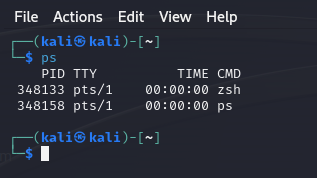
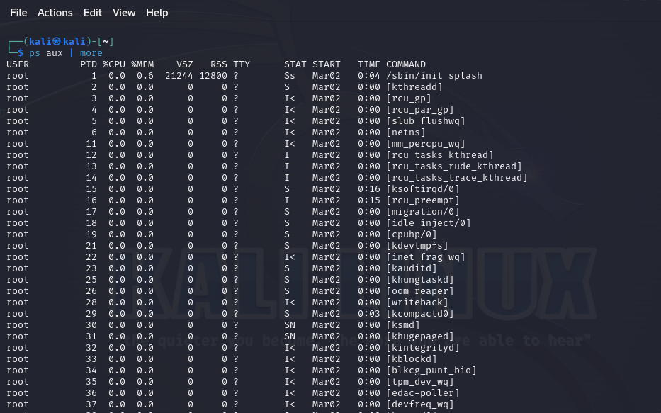
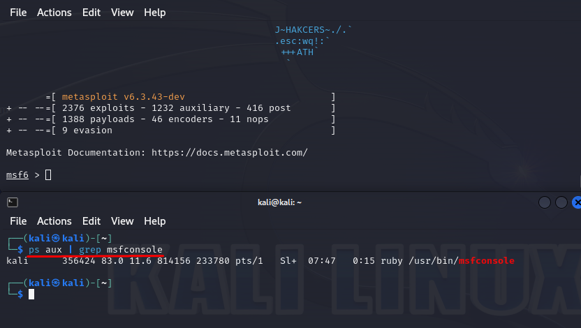
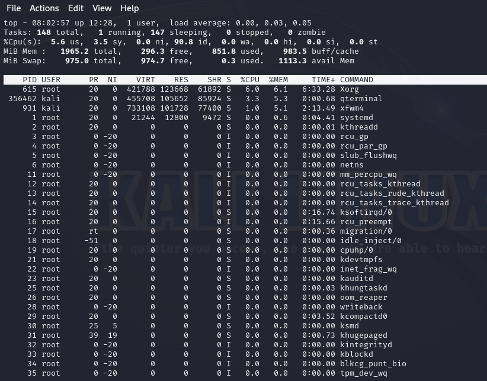
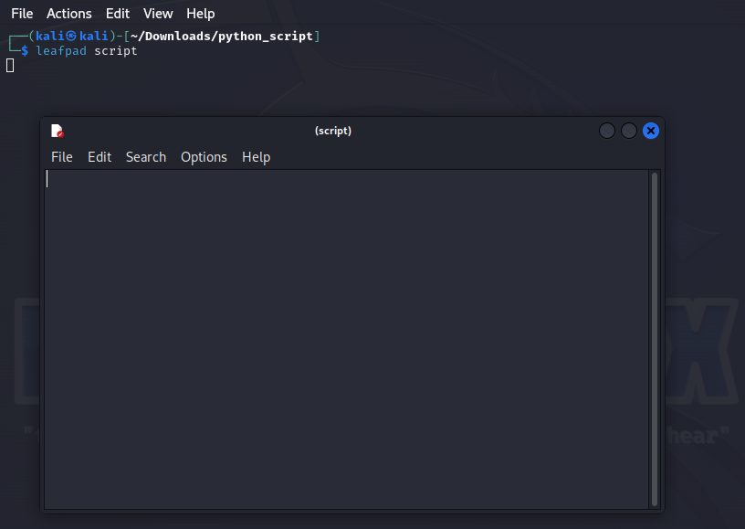
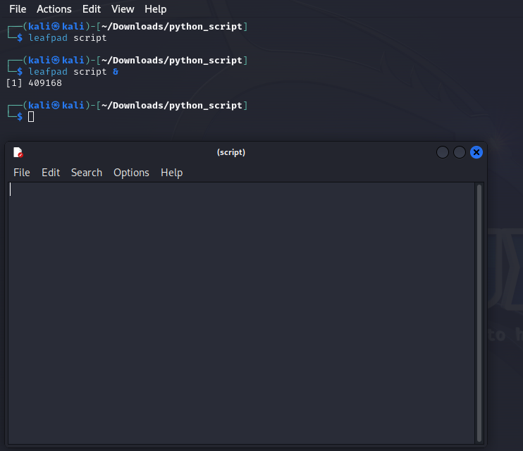

Em determinado momento, um sistema Linux geralmente tem entre 100 e 1000 processos em execução simultaneamente. Um processo é simplesmente um programa em execução que está utilizando recursos do sistema.

Exemplos: Terminal, web server, qualquer comando e qualquer database.

É crucial compreender como gerenciar esses processos, pois quando um hacker obtém acesso a um sistema, ele tem o conhecimento para interromper processos, executar scripts e até mesmo agendar tarefas.

# Processos de visualização
Primeiro vamos entender como visualizar qual processo esta rodando no seu sistema. Comando mais utilizado para visualização de processo é o `ps`.



O kernel do Linux, o núcleo interno do sistema operacional responsável por controlar praticamente todos os aspectos, atribui um Identificador de Processo (PID) exclusivo a cada processo, à medida que são criados sequencialmente. É importante notar que, ao lidar com processos, é geralmente mais relevante focar no PID do que no nome do processo.

Quando o comando "ps" é executado sem opções, lista os processos iniciados pelo usuário conectado no momento (no caso, root) e os processos em execução no terminal específico. Para obter mais informações sobre todos os processos em execução no sistema, incluindo aqueles de outros usuários, usamos o comando "ps aux". Isso mostra uma lista detalhada de todos os processos em execução.



Como esse comando vai exibir todos os comando vamos usar o more para maiores detalhes.

- **User:** O usuário que iniciou o processo.
- **PID:** O identificador único do processo.
- **%CPU:** A porcentagem da CPU que o processo está utilizando.
- **%MEM:** A porcentagem de memória que o processo está utilizando.
- **COMMAND:** O nome do comando que iniciou o processo.

### Filtrar processo por nome



Podemos usar filtros para encontrar processos que estão em execução. Por exemplo, podemos usar o comando "ps" com filtros específicos para localizar o processo da Ferramenta Metasploit em outro terminal depois de inicializá-lo. Observar que as colunas de cabeçalho podem não estar presentes para processos que não são exibidos no cabeçalho.

### Filtrando processo com TOP
Quando executamos o comando ps, os processos exibidos estão ordenados pelo momento em que foram iniciados, ou seja, pela ordem do PID (identificador de processo). Em certos casos, é importante identificar qual processo está consumindo mais recursos. Além disso, o comando `ps` fornece apenas uma "foto instantânea (snapshot)" dos processos em execução, não oferecendo uma visualização em tempo real. Para uma abordagem mais próxima disso, podemos usar o comando `top`, que atualiza a exibição a cada 3 segundos por padrão e apresenta os processos ordenados pelo consumo de recursos.



Muitos administradores do sistema, e até mesmo hackers, utilizam essa tela constantemente para monitorar recursos. Para compreender melhor o comando, basta pressionar a tecla `H` ou `?`.

### Gereciando o processo
Os hackers frequentemente precisam de capacidade de multiprocessamento, e um sistema operacional como o Kali é ideal para isso. O hacker pode ter um port scanner em execução enquanto realiza um scan de vulnerabilidades e um exploit simultaneamente.

### nice
Vários processos são executados no sistema ao mesmo tempo, e todos competem pelos recursos disponíveis. O kernel determina a prioridade de um processo, mas você pode usar o comando "nice" para sugerir que a prioridade de um processo seja elevada. Um valor <font color="red">**alto**</font> de "nice" se traduz em uma prioridade <font color="red">**baixa**</font>  para o processo, e um valor <font color="gree">**baixo**</font> se traduz em uma prioride <font color="gree">**alta**</font> para o processo.

| -20         |      0      |     +19       |
| :---        |    :----:   |          ---: |
| Maior probabilidade de receber prioridade | Valor padrão de nice | Menor probabilidade de receber prioridade   |

Exemplo que poderiamos usar para configurar uma prioridade quando um processo iniciar:

`kali >nice -n -10 /bin/slowprocess`

### renice
Tambem temos o comando `renice` que podemos alterar a prioridade de um processo que esta em execução. O comando `renice` usa valores absolutos entre -20 e 19 e define a prioridade para esse nível específico, em vez de aumentar ou diminuir a partir do nível em que começou, alem disse o comando `renice` precisa mencionar o PID do processo, por exemplo:

`kali >renice 6996`

>Apenas o usuário root tem permissão para utilizar o comando "renice" para atribuir um valor de prioridade negativo a um processo, o que resulta em uma prioridade alta.

# kill (Matando um processo)
As vezes precisamos eliminar um processo que está consumindo muito recurso ou até mesmo congelado, chamamos isso de "rogue process". Utilizamos o comando `kill` para interromper processos, o comando `kill` possui 64 sinais diferentes, cada um com uma função ligeiramente distinta. Vamos conhecer esses indicadores (signals):

| Nome do Signal  | Numero da opcao | Descricao    |
| :---        |    :----:   |          ---: |
| SIGHUP      | 1      | (Hang Up) Interrompe e reinicia com o mesmo PID   |
| SIGINT      | 2      | (Interrupt) é um sinal de interrupção fraco, mas as vezes pode funcionar      |
| SIGQUIT     | 3      | (core dump) encerrar o processo e salva a informacao do processo na memoria      |
| SIGTERM     | 15     | (TERM) É o sinal de interrupção padrão do comando kill.      |
| SIGKILL     | 9      | Esse é o sinal de eliminação absoluta. Ele força o processo a parar, enviando os recursos do processo para um dispositivo especial, /dev/null. |

Exemplos de comando:

`kill -1 6996`

`kill -9 6996`

> Caso voce nao saiba o PID do processo, voce pode usar o comando `killall`, esse comando usa o nome do processo.

`killall -9 rogueprocess`

# Executando processos em Background
As vezes precisamos rodar processos em background, isso é eficaz para qualquer processo que possa ser executado por um período de tempo significativo quando você quiser usar o terminal.

Exemplo de um programa rodando normalmente:



Agora rodando em background, pode ver que consigo utilizar o terminal:



### Para utilizar em Foregroud (primeiro plano)
Utilizamos o seguinte comando:

`fg 1234 (PID)`

> Para hackers, é essencial executar vários terminais com diversas tarefas simultâneas.

# Agendando processos
Sysadmins e hackers precisam agendar processos para serem executados em momentos específicos do dia. Por exemplo, agendar um backup para ser realizado toda sexta-feira às 19h. No Linux, você pode fazer isso de pelo menos duas maneiras: `at` e `crond`.

### at
O comando `at` é usadi para configurar o *daemon* -- Um processo background -- *atd*, que é útil para agendar uma tarefa para ser executada uma vez em algum momento no futuro.
O comando `crond` daemon é mais adequado para agendar tarefas que sao executadas a cada dia, semana ou mês. (Vamos cobrir esse comando mais pra frente)

| Formato de hora  | Significado | 
| :---             |    :----:   |          
| at 7:20pm         | Agendado para executar as 7:20pm no dia atual  | 
| at 7:20pm June 25          | Agendado para executar as 7:20pm em 25 de Junho          | 
| at tomorrow        | Agendado para executar no dia seguinte          | 
| at now + 5 day          | Agendado para executar em 5 dias a partir da data atual          | 
| at 7:20pm 06/25/2024        | Agendado para executar as 7:20pm no dia 25/06/2024          | 

Quando voce configura usando o comando `at` voce entra no modo interativo ai basta apontar o script desejado:

```bash
kali >at 7:20pm
at >/root/meu_scanner_script
```
>Quando quiser parar de digitar comandos, pressione CRTL-D.

