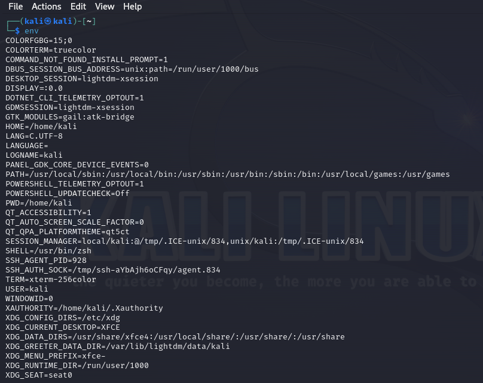
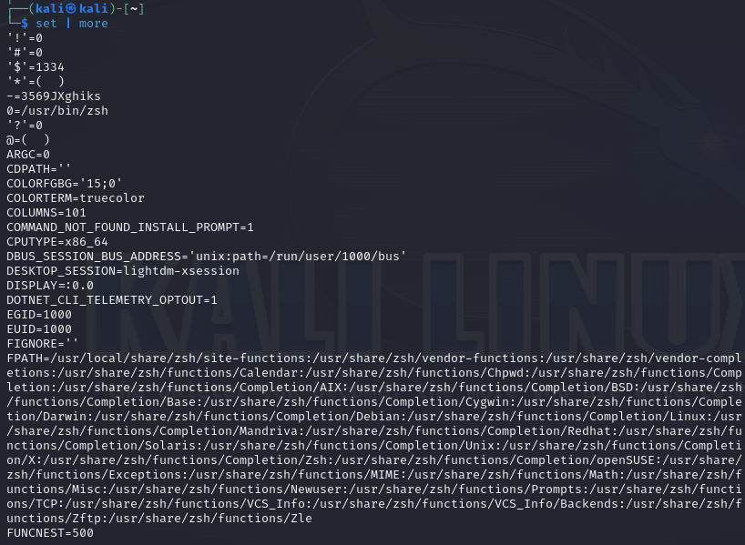
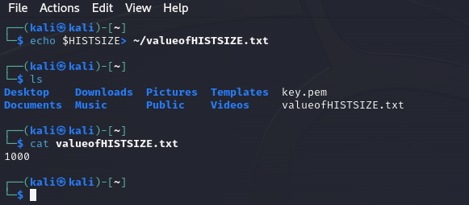
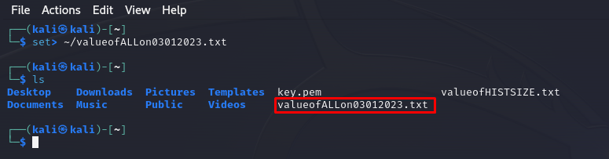
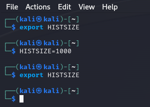

# Gerenciamento de variáveis de ambiente do usuário
Para obter o máximo do seu sistema de hacking do Linux, você precisa entender as variáveis de ambiente e ser hábil em gerenciá-las para otimizar o desempenho, a conveniência e até mesmo a discrição. No entanto, entre as áreas que os novatos no Linux consideram problemáticas, o gerenciamento das variáveis de ambiente do usuário pode ser a mais difícil de dominar. Existem dois tipo de variables: *shell* e *environment*.

As variáveis são simplesmente cadeias de caracteres em pares de valores-chave. Geralmente, cada para par será parecido com **KEY=value** e em alguns casos com varios valores **KEY=value1:value2**. 

Cada usuário, incluindo o *root*, tem por padrão um conjunto de variáveis de ambiente que determina como o seu sistema irá aparecer, agir e se comportar. Você pode modificar esses valores conforme necessário.

# Visualizar e modificar variaveis do env
Voce pode ver toda a variavel do env digitando `env` no seu terminal.

Variaveis do ambiente sao sempre letras maiúsculas, como HOME, PATH, SHELL e assim vai.

### Visualizar todas as variaveis de ambiente
Para visualizar todas as variaveis de ambiente use o comando `set`, esse comando irá listar todas variáveis de ambiente exclusiva do seu sistema. 

### Alterando valor da variavel por sessao
Vamos alterar o valor da variável **HISTSIZE**, que determina o número máximo de comandos que serão armazenados no arquivo de histórico de comandos. 

`kali >HISTSIZE=0`

A partir de agora, nenhum comando será armazenado no histórico.

### Alterando permanentemente
Para cada mudança precisamos sempre salvar ou fazer um backup antes com isso vamos primeiro realizar o backup de duas maneiras.

Salvando em .txt:

Voce tambem pode salvar tudo, ser mais cauteloso ainda:

Depois de ter feito o backup podemos alterar permanentemente usando comando `export`:

# Alterando Shell prompt
Seu prompt de shell, além de outras variáveis de ambiente, fornece informações úteis, tais como o usuário que está logado e o diretório de trabalho atual.