# Text Manipulation

No Linux, praticamente tudo com o que você interage diretamente é um arquivo. Para reconfigurar uma aplicação, você abre o arquivo de configuração, edita o texto, salva as alterações e então reinicia a aplicação. Vamos aprender como manipular arquivos no Linux.

Usaremos o *snort* como exemplo. Caso tenha dificuldade em visualizar o arquivo de configuração, siga estas etapas:

**1.Faça um backup do sources.list do Kali**

mv /etc/apt/sources.list /etc/apt/sources.list.bak

**2.Remova as atualizações**

find /var/lib/apt/lists -type f -exec rm {} \;

**3.Altere o conteúdo do sources.list**

sudo nano /etc/apt/sources.list

##### Cole o seguinte conteúdo:
deb http://archive.ubuntu.com/ubuntu/ focal main restricted universe multiverse
deb-src http://archive.ubuntu.com/ubuntu/ focal main restricted universe multiverse
deb http://archive.ubuntu.com/ubuntu/ focal-updates main restricted universe multiverse
deb-src http://archive.ubuntu.com/ubuntu/ focal-updates main restricted universe multiverse
deb http://archive.ubuntu.com/ubuntu/ focal-security main restricted universe multiverse
deb-src http://archive.ubuntu.com/ubuntu/ focal-security main restricted universe multiverse
deb http://archive.ubuntu.com/ubuntu/ focal-backports main restricted universe multiverse
deb-src http://archive.ubuntu.com/ubuntu/ focal-backports main restricted universe multiverse
deb http://archive.canonical.com/ubuntu focal partner
deb-src http://archive.canonical.com/ubuntu focal partner

##### Se estiver utilizando o Kali como uma máquina virtual, cole o seguinte:
deb [arch=arm64] http://ports.ubuntu.com/ubuntu-ports focal main restricted universe multiverse
deb [arch=arm64] http://ports.ubuntu.com/ubuntu-ports focal-updates main restricted universe multiverse
deb [arch=arm64] http://ports.ubuntu.com/ubuntu-ports focal-security main restricted universe multiverse
deb [arch=i386,amd64] http://us.archive.ubuntu.com/ubuntu/ focal main restricted universe multiverse
deb [arch=i386,amd64] http://us.archive.ubuntu.com/ubuntu/ focal-updates main restricted universe multiverse
deb [arch=i386,amd64] http://security.ubuntu.com/ubuntu focal-security main restricted universe multiverse

**4. Adicione as chaves públicas especificadas**

sudo apt-key adv --keyserver keyserver.ubuntu.com --recv-keys 3B4FE6ACC0B21F32
sudo apt-key adv --keyserver keyserver.ubuntu.com --recv-keys 871920D1991BC93C

**5. Atualize**

sudo apt update

**6. Agora instale o snort**

sudo apt install snort

---

## cat
Como explicamos no arquivo comandos-basicos o `cat` é provavelmente o comando mais básicos para exibição de texto. o `cat` te mostra todo o arquivo até o final, isso as vezes pode ser um pouco pratico 🙃, Imagine um arquivo grande e você precisa ler o final ou o meio do arquivo.

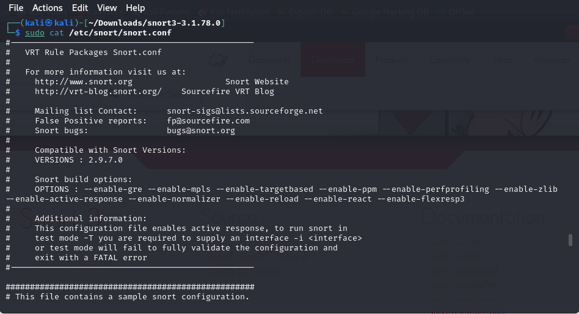

## head
Se voce quiser ver o **inicio** de um arquivo voce pode usar o `head`, por padrão, ele mostra as 10 primeiras linhas do arquivo.

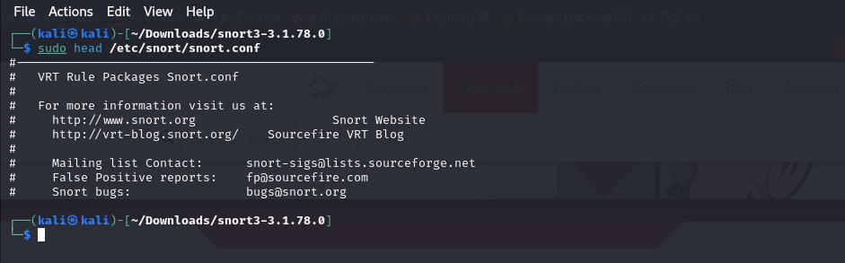

Se voce quiser ver mais do que 10 linhas voce pode usar o `-` seguido do numero desejado de linhas. Por exemplo: `-20`

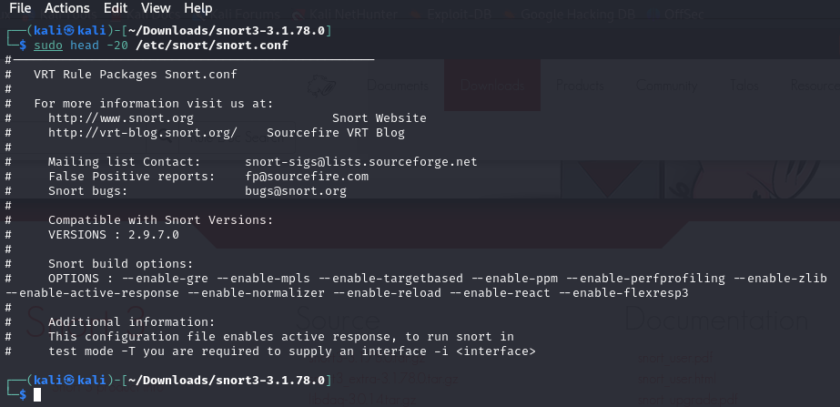

## tail
O comando `tail` é similar ao `head`, mas seu objetivo é ver as **ultimas** linhas. 

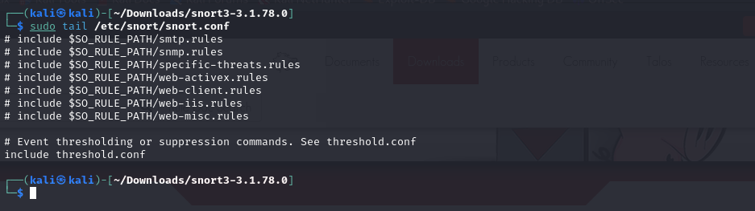

Assim como o `head` para ver mais do que 10 linhas, pode usar o `-` seguido numero desejado de linhas. Por exemplo: `-20`

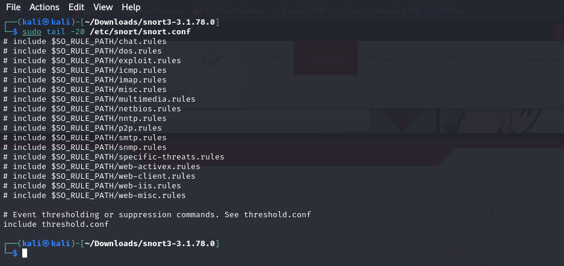

## nl
As vezes, precisamos visualizar a sequencia das linhas com numeros, por exemplo, em arquivos grandes, quando queremos saber em qual linha está uma parte especifica daquele script, usamos o nl.

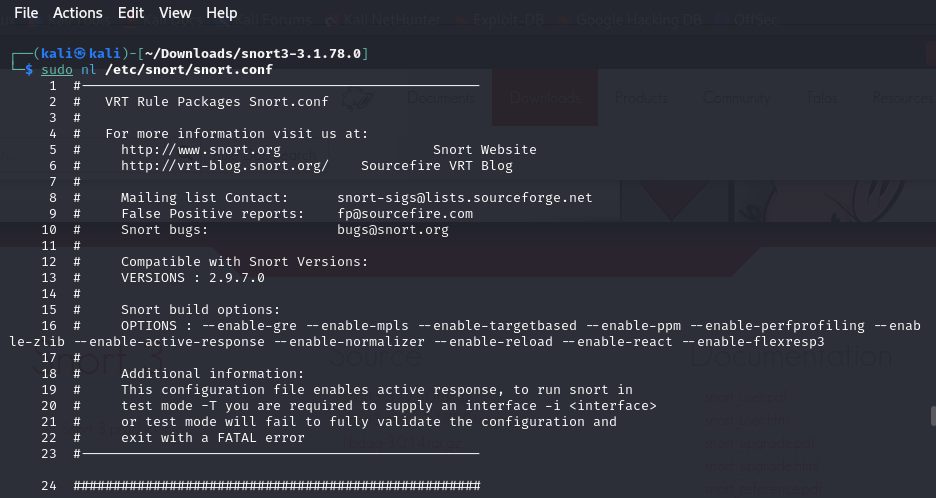

## Filtrando o texto com grep
o grep é o comando mais utilizado para filtrar texto. Voce pode filtrar o conteudo do arquivo, por exemplo, procurando algo relacionado a **output**.

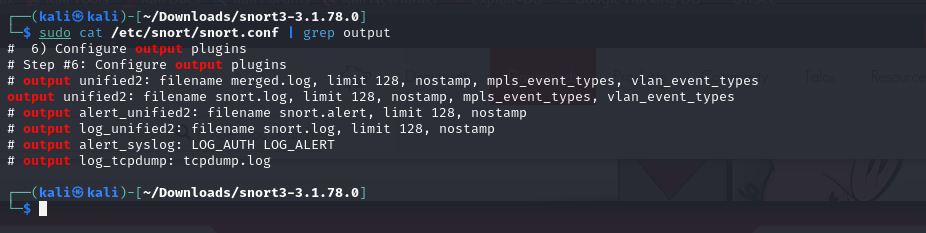

usamos o `|` para enviar o conteudo para o `grep` que irá processar o arquivo como entrada.

## Desafio

#### **STEP 1**

Vamos dizer que queremos exibir 5 linhas antes de uma linha que diz **# Step #6: Configure output plugins**  usando apenas 4 comandos que aprendemos. Não se esqueça de usar o `man` para entender melhor sobre o comando.

Existem várias maneiras de fazer isso:

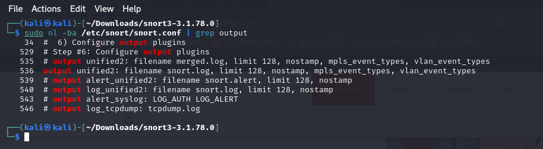

Podemos ver que a linha com **# Step #6: Configure output plugins** é a 529 e queremos as cinco linhas anteriores à ela, bem como a própria linha 529 (ou seja, as linhas 524 a 529).

Utilizamos o `-ba` para numerar todas as linhas, incluindo as vazias.

#### **STEP 2**

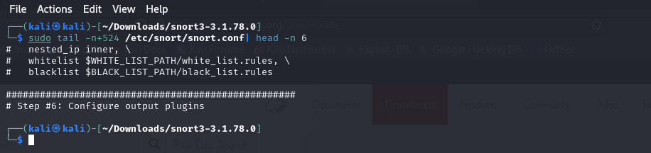

Usamos o `tail` para começar na linha 524 e, em seguida, enviar para o `head`, e assim retornamos apenas as seis primeiras linhas.

## sed
O comando `sed` permite que você pesquise ocorrências de uma palavra ou padrão de texto e, em seguida, execute alguma ação sobre ele. Basicamente, ele encontra uma palavra e a substitui de acordo com o critério especificado.

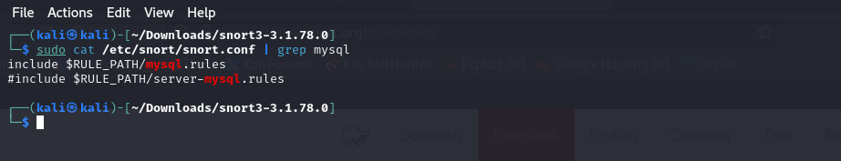

Podemos ver duas saidas com a palavra *mysql*, vamos criar um novo arquivo *snort* para usarmos como exemplo. Neste caso vamos mudar a palavra *mysql* para *MySQL*.

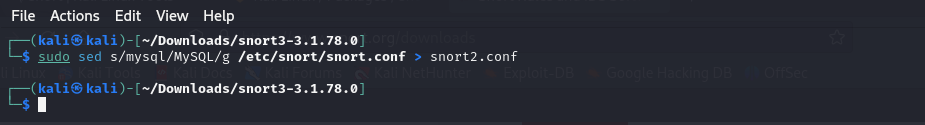

O comando `s` realiza a *substituicao*, nesse caso especificamos a palavra que queremos substituir *mysql* e depois como queremos substituir *MySQL*, separados por `/`. Já o `g` indica que queremos fazer isso de forma Global, e então salvamos as alteracoes em um novo arquivo *snort2.conf*.

Caso queira substituir apenas a primeira ocorrência do termo *mysql*, deixe de fora a opção `g` no final.

Voce tambem pode especificar o `/2` no final para substituir apenas a segunda ocorrência do termo *mysql*.

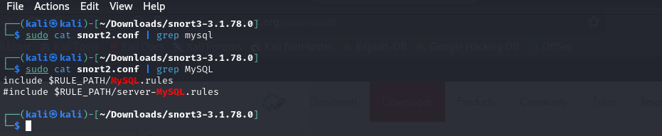

Como podemos ver, o novo arquivo foi alterado conforme o esperado.

# more
O comando `more` exibe uma página do arquivo de cada vez e permite que você navegue pelas páginas pressionando `ENTER`.

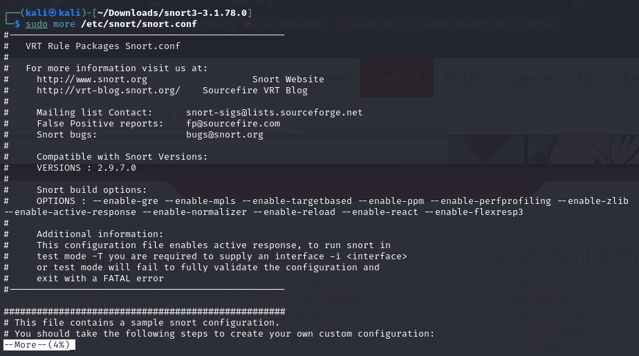

Como mostrado, ele exibe a primeira página e aguarda. Pressionando `ENTER`, você pode percorrer as páginas.

# less
O Comando `less` é semelhante ao `more`. Com o `less`, você não só pode percorrer um arquivo à vontade, mas também pode filtrá-lo por termos.

`sudo less /etc/snort/snort.conf`

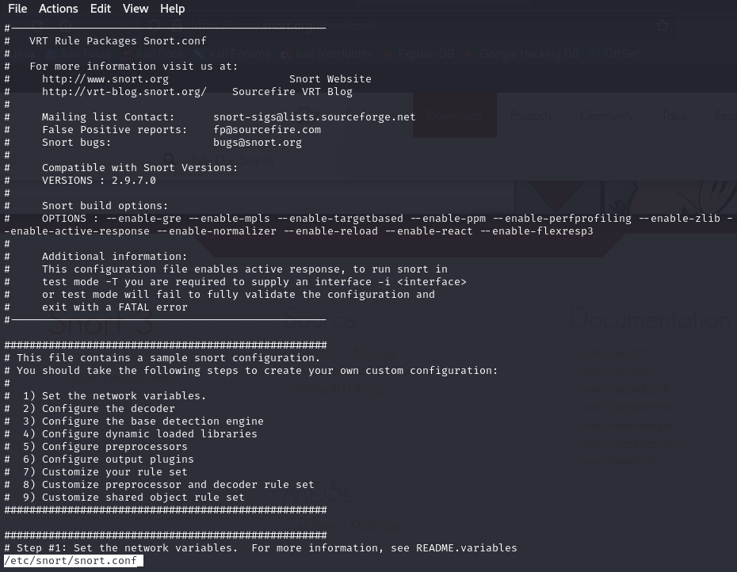

#### Com `less` você também pode filtrar.

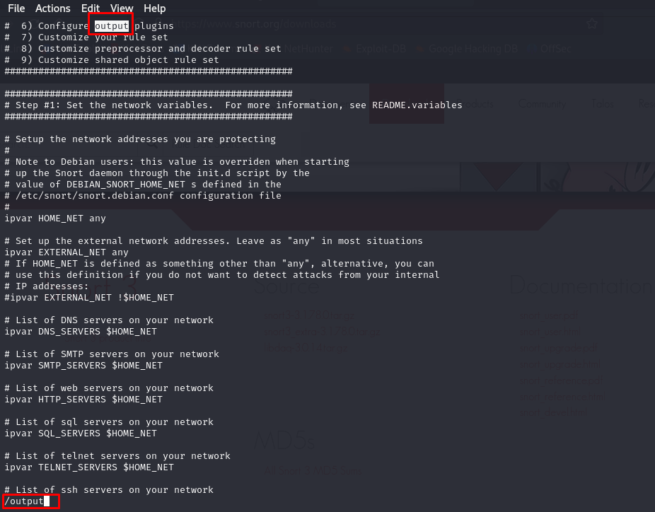

