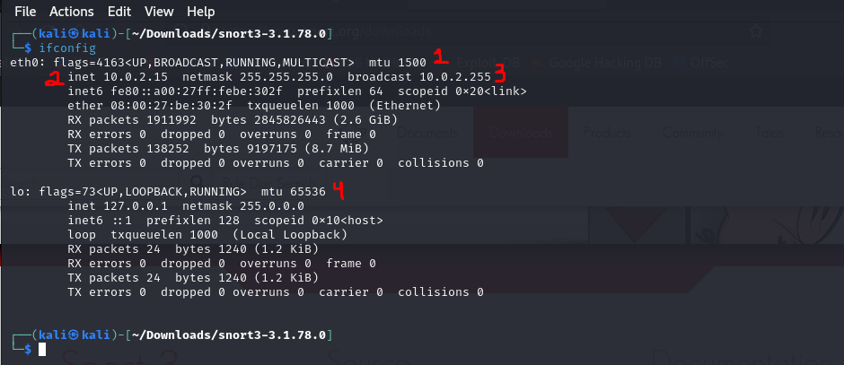
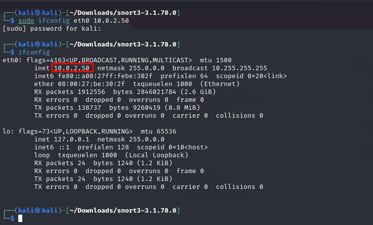
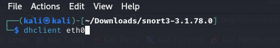
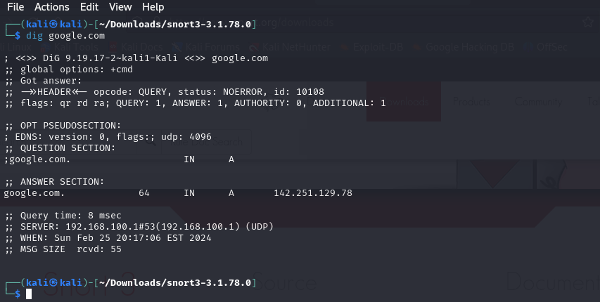
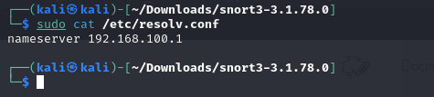
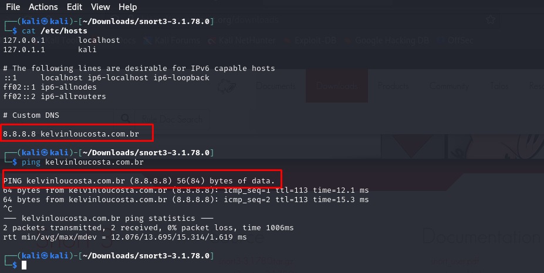

# Explorando as Redes: O Primeiro Passo para se Tornar um Hacker Ético

Para se tornar um hacker ético, é crucial ter um entendimento sólido de redes. Neste capítulo, vamos mergulhar um pouco sobre este assunto.

## Compreendendo as Redes

O mundo digital é composto por redes. São como túneis secretos que os hackers exploram em busca de informações importantes. Para navegar com habilidade neste mundo, é fundamental entender como as redes funcionam.

## Fundamentos da Rede

Antes de começarmos a explorar técnicas avançadas de hacking ético, vamos estabelecer uma base sólida. Aqui estão alguns conceitos fundamentais:

# ifconfig

Como podemos ver o comando ifconfig exibi algumas informacoes uteis sobre a interface de rede. 

1 - `eth0` esse é o nome da interface, que é a abreviação de Ethernet0, no Linux se inicia com **0**. Podemos ver tambem o endereço mac seguido por `ether`, Esse é o endereço de controle que está gravado em cada componente de hardware de rede em todo o mundo - neste caso, a placa de interface de rede (NIC).

2 - A segunda linha informa o IP address ou endereço de IP atualmente atribuído a essa interface de rede. Tambem temos mascara de rede (netmask) que é usada para determinar qual parte do endereço IP está conectada à rede local.

3 - Seguindo temos o endereço de broadcast que é o endereço usado para enviar informações a todos os IPs na sub-rede.

4 - por ultimo temos o endereço de loopback as vezes chamado de locahost. Esse endereço de software especial que conecta você ao seu próprio sistema, muito utilizado para testes.

> :memo: **Note:** Voce pode utilizar o comando `iwconfig` caso tenha um USB externo para wireless. Importante para teste usando a ferramenta **aircrack-ng**.

# Alterando o IP
Importante ter o conhecimento de como alterar informacoes da rede. Para mudar o endereço de IP, inserimos o comando ifconfig seguido pela interface desejada e por fim o IP que deseja alterar.

Voce tambem pode mudar a mascara de rede e o endereço de broadcast.

Você também pode usar o `ifconfig` para alterar seu endereço MAC. O endereço MAC é globalmente exclusivo e é frequentemente usado como medida de segurança para manter os hackers fora das redes ou para rastreá-las. Trocar o MAC é uma tecnica muito utilizada para contornar e ter acesso a rede.

Para trocar bastar utilizar esses comandos:

`ifconfig eth0 down`

`ifconfig eth0 hw ether XX:XX:XX:XX:XX:XX`

`ifconfig eth0 up`

# DHCP
O Linux possui um servidor DHCP (Dynamic Host Configuration Protocol) que executa um daemon. Esse daemon é chamado de dhcpd, ou daemon dhcp, um processo que é executado em segundo plano. O servidor DHCP atribui endereços IP a todos os sistemas da sub-rede e mantém arquivos de registro que indicam a qual máquina o endereço IP foi atribuído a qualquer momento.

> :memo: **Note**
Isso o torna um ótimo recurso para os analistas forenses rastrearem os hackers após um ataque. Por esse motivo, é útil entender como rastrear os hackers após um ataque. Por esse motivo, é útil entender como o servidor DHCP funciona.

Para solicitar um IP do DHCP, usamos o comando `dhclient` seguido pela interface desejada.

O comando irá enviar uma solicitação *DHCPDISCOVER* da interface especificada, entao irá receber uma resposta *DHCPOFFER* do DHCP Server.

# DNS
O hacker pode localizar uma coleção de dados sobre um alvo no sistema de nomes de domínio (DNS). O DNS é um componente vital da Internet e, embora seja criado para traduzir nomes de domínio em endereços IP, um hacker pode usá-lo para obter informações sobre o alvo.

Um dos comandos mais comuns para obter informacoes como Endereço IP do servidor de nomes do destino que é o servidor que traduz o nome do destino em um endereço IP, servidor de e-mail do alvo e tambem subdominios é o `dig`.

Podemos ver o endereço de IP do DNS Server que atende *google.com*.

Você também pode usar o comando `dig` para obter informações sobre servidores de e-mail conectados a um domínio adicionando a opção `mx` (mx é a abreviação de *mail exchange server*). Essas informações são essenciais para ataques a sistemas de e-mail. 

`dig google.com mx`

O servidor de DNS mais comum no Linux é o *BIND* (Berkeley Internet Name Domain). Nao confunda os dois. 
O DNS e o BIND mapeiam nomes de domínios individuais para endereços IP.

Para alterar o DNS Server, precisamos alterar o arquivo /etc/resolv.conf

Com o comando `cat` podemos ver o endereço do nameserver que é o enderço local. Para alterar seria somente alterar o texto e alterar o IP e salvar o arquivo, por exemplo para o DNS da Google 8.8.8.8.

Podemos utilizar o comando que aprendemos tambem.

`echo "nameserver 8.8.8.8" > /etc/resolv.conf`

O comando `echo` vai substituir o conteudo.

Um arquivo especial em seu sistema chamado arquivo hosts também realiza a tradução de nome de domínio para endereço IP. O arquivo *host* esta localizado em */etc/hosts*, onde voce pode configurar um dominio para respoder para um IP especifico.

Certifique-se de pressionar a tecla *TAB* nao a de *ESPAÇO*.

> :memo: **Note** Para o Hacker isso pode ser muito util para sequestro (hijacking) de uma conexão TCP em sua rede local para direcionar o tráfego para um servidor da Web mal-intencionado com uma ferramenta como o **dnspoof**.

