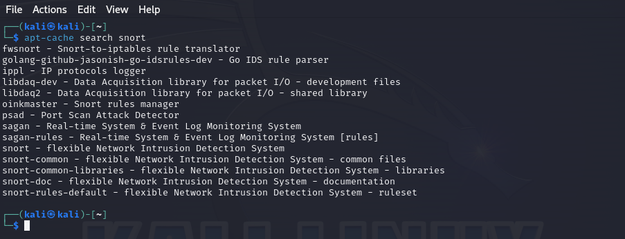
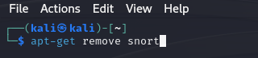
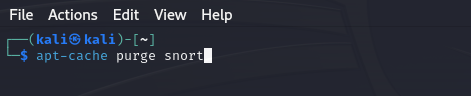

# Adicionando e removendo Software

Uma das tarefas mais fundamentais no Linux ou em qualquer outro sistema operacional é adicionar e remover software. Alguns programas precisam de outros softwares para funcionar e, às vezes, você descobrirá que pode baixar tudo o que precisa de uma só vez em um pacote de software - um conjunto de arquivos ou bibliotecas, como o chamamos. Normalmente, as bibliotecas e outras dependências necessárias para que um software seja executado com êxito são incluídas. Quando você instala um pacote, todos os arquivos contidos nele são instalados juntos. Existem diferentes métodos para realizar essa tarefa, incluindo o uso do gerenciador de pacotes 'apt', instalação via interface gráfica e o uso do Git para baixar o código-fonte diretamente do repositório.

> **:memo:** Nas distribuições Linux baseadas no Debian, como Kali e Ubuntu, o gerenciador de pacotes padrão é o Advanced Packaging Tool, ou apt. Seu principal comando, apt-get, é usado para baixar e instalar novos pacotes de software, bem como para atualizar e fazer upgrade dos existentes. Embora o apt e o apt-get sejam semelhantes, o último oferece mais funcionalidades, sendo válido aprendê-lo desde o início, apesar da preferência de muitos usuários pelo primeiro.

---

Antes de baixar o pacote, é possível verificar se ele ainda está disponível no repositório, onde são guardadas as informações do sistema operacional.

Como podemos ver, tudo relacionado à palavra *snort* será exibido.

# Adição de Software

Agora que confirmamos a existência do pacote `snort`, podemos utilizar o apt-get para baixar o software. O `snort` é um sistema de detecção de intrusão de rede open-source amplamente utilizado para monitorar e analisar o tráfego de rede em tempo real. Para instalá-lo, basta executar o seguinte comando no terminal:

# Remocao de Software

Agora para remover basta executar o seguinte comando no terminal:

**Quando usamos o comando *remove*, ele não exclui o arquivo de configuração. Isso significa que você pode reinstalar o mesmo pacote sem precisar reconfigurar.**

Para remover o arquivo de configuração e ao mesmo tempo o pacote usamos o comando *purge*.

