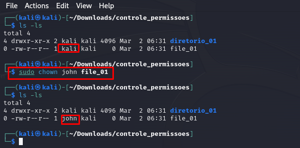
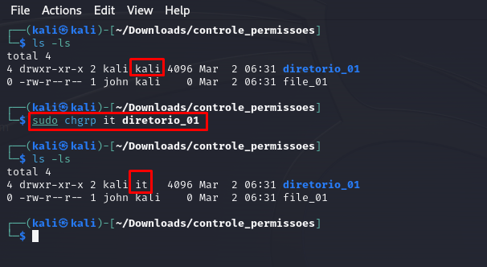
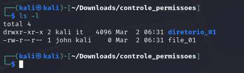
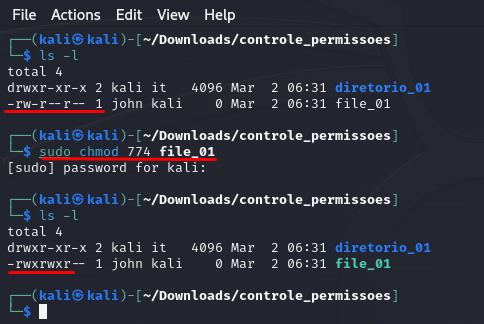
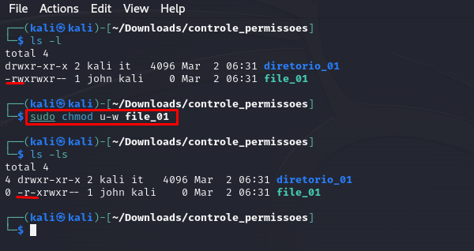

# Permissoes
Nem todos os usuários de um único sistema operacional devem ter o mesmo nivel de acesso aos arquivos e diretorios. Esse sistema de segurança permite que o administrador do sistema **o usuário root** ou **o proprietário do arquivo proteja seus arquivos** contra acesso indesejado ou adulteração, concedendo a usuários selecionados permissões de leitura, gravação ou execução de arquivos.

Vamos aprender como verificar, alterar permissoes em arquivos e diretórios para usuarios especificos, como definir permissões padrão para arquivos e diretórios e como definir permissões especiais.

# Diferentes tipos de usuários
Como sabemos o usuario root é o manda-chuva, basicamente pode fazer o que quiser no sistema, enquanto outros usuarios tem permissioes limitadas, geralmente outros usuarios estao dentro de um grupo, então cada membro do grupo herda as permissões do grupo. Isso é feito principalmente para facilitar a administração das permissões e, portanto, a segurança. O próprio root tambem tem o seu próprio grupo.

Existem 3 niveis de permissoes que são:

1. **Read** > Permissao somente para abrir e visualizar o arquivo.
2. **Write** > Permiti os usuários visualizar e editar o arquivo.
3. **Execute** > Permiti os usuários executar um arquivo (mas nao necessariamente **visualizar** ou **editar**)
   
Quando um usuário cria um arquivo ele automaticamente se torna **proprietario** do arquivo e o *grupo* proprietário é o grupo atual do usuário.

# Atribuição de Propriedade a um Usuário Individual
Para transferir a propriedade de um arquivo para um usuário diferente, de modo que ele possa controlar as permissões, podemos usar o comando `chown` (ou change owner).

Esse comando concede à conta de usuário **john** ser *owner* do arquivo file_01.

# Atribuição de Propriedade a um Grupo
Para transferir a propriedade de um arquivo de um grupo para outro, podemos usar o comando `chgrp` (ou change group).

Os hackers geralmente preferem trabalhar sozinhos do que em grupos, mas não é incomum que vários hackers ou pentesters trabalhem juntos em um projeto e, nesse caso, usar grupos é necessário.

Esse comando passa o grupo *it* como proprietario do diretorio.

# Verificar permissoes
Quando queremos verificar as permissoes de um arquivo ou pasta costumamos usar o comando `ls -l` -l que significa (long), exemplo apresentado anteriormente.

Vamos entender como ler essas permissoes:

**dr** > o tipo de aquivo, nesse caso é um diretorio. Se for *-* seria arquivo.

**rwx** > permissoes dos 1º usuarios e depois 2º grupo (r=read,w=write,x=execute), se tiver *-* é porque a permissao nao foi concedida.

**2,1** > o número de links

**kali it** > usuario e grupo que tem permissoes ao arquivo ou diretorio.

**4096** > tamanho do arquivo em *bytes*

**mes-dia-horario** > quando arquivo foi criado

**name** nome do arquivo ou diretorio

# Alterando permissoes
Utilizamos o comando `chmod` (ou change mode) para alterar permissoes, somente o usuario root ou o proprietario do arquivo (owner) podem alterar as permissoes. Vamos aprender como alterar permissoes nos arquivos utilizando 2 metodos diferentes, primeiro vamos utilizar a forma numerica e depois utilizamos uma representação simbólica.

### Alteração de permissões com notação decimal
Podemos usar um atalho para nos referirmos às permissões usando um único número para representar um ou mais conjuntos de permissões. Como tudo o que está por trás do sistema operacional, permissoes sao representadas em binário, portanto, **ON** e **OFF**, nesse caso **1** e **0**, nesse caso entendemos que quando as permissoes estao setadas como ***rwx*** em binario estaria ***111***.

> Um conjunto binário como esse é facilmente representado como um dígito, convertendo-o em octal, um sistema numérico de oito dígitos que começa com 0 e termina com 7. Um dígito octal representa um conjunto de três dígitos binários, o que significa que podemos representar um conjunto inteiro de *rwx* com um dígito.

Vamos entender melhor com essa tabela:

| Binary |  Octal   |   rwx     |
| :---   |  :----:  |  :----:   |         
| 000    |    0     |   ---     |        
| 001    |    1     |   --x     |          
| 010    |    2     |   -w-     |                   
| 011    |    3     |   -wx     |
| 100    |    4     |   r--     |
| 101    |    5     |   r-x     |
| 110    |    6     |   rw-     |
| 111    |    7     |   rwx     |

Usando as informacos da tabela acima vamos entender mais um pouco. Se quisessemos somente atribuir a permissao de *read*, usariamos o valor de:

| r   | w    | x    |
| :-- | :--: | :--: |
| 4   | -    | -    |

Agora vamos atribuir permissoes de *write* e *execute*.

| r   | w    | x    |
| :-- | :--: | :--: |
| -   | 2    | 1    |

Repare que na table o octal que representa *-wx* é 3, que, não por coincidência, são os mesmos valores que obtemos quando adicionamos os dois valores para definir w e x individualmente: `2 + 1 = 3`

Por fim, quando todas as três permissões estão ativadas, seria o seguinte:

| r   | w    | x    |
| :-- | :--: | :--: |
| 4   | 2    | 1    |

Se somasse novamente `4 + 2 + 1 = 7`, representado pelo octal equivalent de 7.

> Para representar todas as permissoes, (owner, grupos, todos os usuarios), poderíamos escrevê-lo da seguinte forma: `7 7 7`.

É aqui que entra o atalho. Ao passar ao `chmod` três dígitos octais (um para cada conjunto rwx), seguidos de um nome de arquivo, podemos alterar as permissões desse arquivo para cada tipo de usuário.

Nesse caso podemos ver que a alteracao foi feita e que somente o **owner** e o **grupo** tem permissao para executar o arquivo file_01.

### Alteração de permissões com UGO
Agora vamos aprender alterar as permissoes com simbolos, os dois metodos sao utilizados, embora esse metodo seja mais intuitivo. O que é UGO? vamos lá: **U**=user (ou owner), **G**=group, **O**=others.

Utilizamos metodos semelhantes, usamos o comando `chmod` seguido por u,g,o e mais os simbolos:

- **-** > Remove uma permissao
- **+** > Adiciona uma permissao
- **=** > Define uma permissão

Vamos ao exemplo, se quisessemos remove a permissao de *write** de um usuario no arquivo file_01, usariamos o seguinte comando:

Podem ver que removemos a (-) a permissao de *write* para o usuário (u) do arquivo file_01.

Podemos utilizar multiplas permissoes no mesmo comando.

`chmod u+x, o+x file_01`

Este comando adicionaria permissao de *executar (x)* tanto para usuario quanto para grupo.

