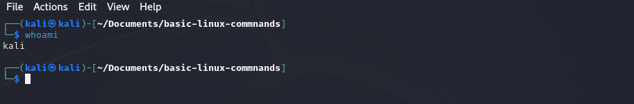
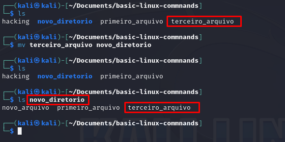

# Comandos Básicos do Linux

Este guia apresenta alguns comandos básicos do Linux que são úteis para navegação, pesquisa e manipulação de arquivos e diretórios.

## pwd
O comando `pwd` mostra o diretório atual.

## whoami
Para verificar qual usuário está logado.

## cd
Para mudar de diretório. É essencial saber como navegar pelos diretórios, e o comando `cd` nos ajuda com isso. Para subir um nível na estrutura de diretórios, use `cd ..`, Por exemplo, se estou no diretório `/etc` e quero voltar para o diretório raiz, uso `cd ..` e verifico com `pwd` o diretório atual.

## ls
Para listar o conteúdo de um diretório (arquivos e subdiretórios), usamos o comando `ls`, semelhante ao `dir` do Windows. Para obter mais informações sobre arquivos e diretórios, como permissões, proprietário, tamanho e data de modificação, use `ls -l`. Também temos a opção `ls -la` para visualizar arquivos ocultos.

## --help
Fornece um guia mais focado em como utilizar cada comando, aplicação ou utilitários.

Podemos utilizar essas 3 opcoes:
`--help`, `-h`, e `-?`

## man
O comando `man` fornece documentação abrangente na forma de páginas de manual, cobrindo todos os aspectos de um comando ou tópico em detalhes.

`man aircrack-ng`

## locate
Comando para percorrer todo o sistema de arquivos e localizar todas as ocorrências de uma palavra.

`locate aircrack-ng`

O comando `locate` tem algumas limitações; os resultados podem ser grandes e a base de dados é geralmente atualizada uma vez ao dia, ou seja se fazem apena alguns minutos desde que você criou algum arquivo e quer localizá-lo, só sera localizado usando esse comando no dia seguinte.

## whereis 
Para localizar arquivos executáveis, use o comando `whereis`. Esse comando retorna até o arquivo onde se encontra a página do manual. Nesse caso ele só retorna apenas os executaveis da aplicação que voce esta tentando localizar e mais a pagina do manual, mais eficiente, não acha?

## which
Ainda mais específico, o comando `which` retorna somente a localização do executável na variável PATH no Linux.

## find 
O comando `find` é o mais avançado e flexível dos utilitários de busca. Ele é capaz de iniciar sua pesquisa em qualquer diretório designado e procurar vários parâmetros diferentes, incluindo, é claro, o nome do arquivo, mas também a data de criação ou modificação, o proprietário, o grupo, as permissões e o tamanho.

Aqui está a sintaxe básica para encontrar um arquivo.

`find` diretório opção expressão

Se quiséssemos encontrar um arquivo com o nome apache2 que é servidor web de código aberto iniciando no diretorio root, seria assim:

`find / -type f -name apache2`

`/` -> diretorio onde eu quero iniciar minha busca.

`f` -> especificar que tipo de arquivo buscar, f indica um arquivo comum.

`apache2` -> o nome do arquivo que estamos procurando.

como podemos imaginar essa busca demoraria, uma forma de acelerar é colocar um diretorio mais especifico para busca, por exemplo em vez de `/` colocariamos `/etc`, ai buscaria abaixo dele, somente os seus subdiretorios.

> [!NOTE]
Devemos nos atentar que o comando `find` mostra somente o nome exato do arquivo, por exemplo se voce estiver tentando encontrar **apache2.conf** essa busca anterior não encontraria, não encontraria. Nesse caso, teríamos que usar **"wildcards"** que nos permite a dar match em varios caracteres, por exemplo: `*`, `.` , `?` and `[]`.

`find /etc -type f -name apache2.`

agora ele retornará o que se encaixa no padrão `apache2.*`

## grep e ps 
o comando `grep` nos auxiliar buscando palavras chaves como um filtro de busca, o comando `ps` é usado para mostrar informações sobre os processo que estão rodando na máquina, nesse caso podemos usar o comando `"ps aux"` junto com o `grep` para filtra um processo.

`ps aux | grep apache2` ->  nesse caso só vai mostrar informacoes desse processo, lembre sempre de usar o `"|"` depois do comando seguido de `grep`.

# Modificando arquivos e Diretorios.

Existem várias maneiras de criar arquivos no Linux, vamos ver algumas delas.

# cat
o ´cat´ é um comando geralmente utilizado para exibir conteudos de um arquivo, mas ele tambem pode ser usado para criar arquivos pequenos. Para arquivos maiores é melhor digitar o código em um editor de texto, como o vim, emacs, leafpad, gedit ou kate e assim salva-los.

Mas para criar com `cat`, seria:

Parece confuso ao criar, mas quando voce estiver criando usando o `cat` ele vai entrar no modo interativo e, para finalizar o comando voce precisa pressionar **CTRL-D**.

Para ver o conteudo utilize o `cat` seguido o nome do arquivo.

Para adicionar mais conteudo no arquivo, voce pode utilizar o comando com `>>` e digitar o que voce quer adicionar e pressionar **CTRL-D**. Entao voce tera uma nova frase adicionado por exemplo.

Se voce quiser substituir é só repetir como se estivesse criando.

## touch
Originalmente criado para que um usuário pudesse simplesmente `touch` em um arquivo para alterar alguns de seus detalhes, como a data em que foi criado ou modificado, mas se o arquivo nao existir ele irá criar o arquivo.

## mkdir
abreviacao de make directory, comando para criar diretorios.

## cp 
comando para copiar arquivos. Ele cria um arquivo duplicado na nova localizacao, ele nao move o arquivo.

Você pode renomear o arquivo ao copiar se quiser.

## mv
O Linux não tem um comando específico para renomear arquivos. Com isso, utilizamos o comando `mv` que serve tanto para mover um arquivo quanto para renomeá-lo.

## rm 
para remover um arquivo voce utiliza o comando `rm`.

## rmdir
para remover diretorios, utilizamos o `rmdir`. É importante ressaltar que não conseguimos remover diretórios que não estão vazios, isso serve como segurança para nao apagar arquivos sem o conhecimento. Caso voce queira remover com conteudo no diretorio voce acrescenta o `-r` na frente do `rmdir`, tenha bastante cuidado ao utilizar.
